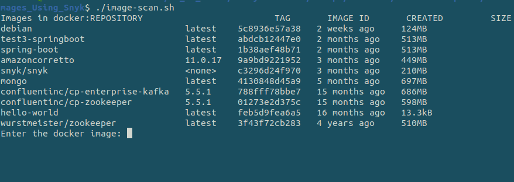
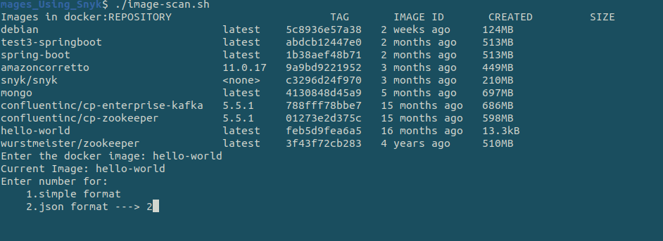
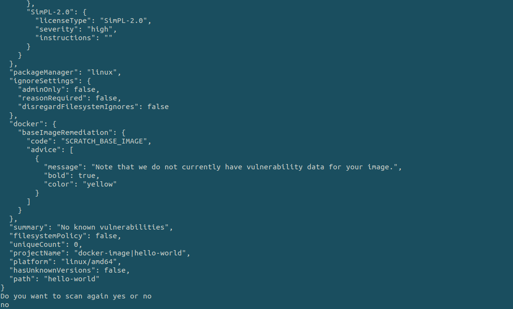

## Description

Here, In this template you will learn about scanning tool Snyk which allows to scan and check vulnerabilities in our Docker Images with various formats.

---

#### Pre-requisite

* Snyk Account
* Docker

---

### Steps:-
1. Go to the terminal and run the command `./image-scan.sh`
2. Go to any suitable IDE and just run the file. 

---

### Outputs
Enter the name of the image you want to scan :

Enter the choice in which you want to print the result:

You if want to continue type "yes" otherwise "no":

---
